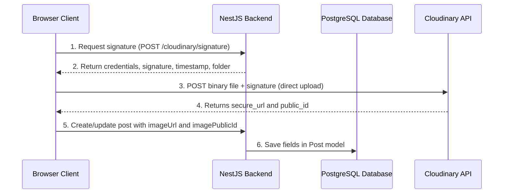

# Cloudinary Image Upload Architecture

This document details the configuration, endpoints, and upload architecture for Cloudinary integration in the Pulse platform.

## Configuration & Environment Variables

Make sure the following variables are configured in the NestJS backend environment:

- `CLOUDINARY_CLOUD_NAME`: Cloudinary account cloud identifier.
- `CLOUDINARY_API_KEY`: Cloudinary API credential key.
- `CLOUDINARY_API_SECRET`: Cloudinary API secret key. **Do not expose this variable to the client/browser.**

These values are mirrored in `.env.example`.

## Architecture Flow

To avoid proxying large binary assets through NestJS (which degrades API responsiveness), Pulse uses **direct signed uploads**:

### 1. Signature Request
**Route**: `POST /api/v1/cloudinary/signature` (Authenticated)
Generates the cryptographic signature for direct uploads. Restricts upload target path to `pulse_posts/${userId}`.

### 2. Asset Deletion
**Route**: `POST /api/v1/cloudinary/delete` (Authenticated)
Allows secure removal of uploaded assets.
- **Security Check**: The backend verifies that the requested `publicId` starts with `pulse_posts/${userId}/`, preventing unauthorized deletion of other users' files.

### 3. Cleanup on Replacement and Deletion
- **Post Edit / Replacement**: If a post is updated with a new image, the previous Cloudinary asset is automatically destroyed after the database update succeeds.
- **Post Deletion**: When a post is deleted, the database record is removed first. If the database delete is successful, the associated asset is cleared in the background. Failures to connect to Cloudinary are caught and logged so that database transaction integrity remains intact.

## Mock Testing

For Jest integration suites, Cloudinary is mocked inside [pulse-integration.spec.ts](file:///c:/Users/ADMIN/Desktop/pern/assesment/pulse/apps/api/src/pulse-integration.spec.ts). The mock interceptor simulates:
1. `api_sign_request` generation.
2. `uploader.destroy` resolution, including simulating failure boundaries to verify transactional robustness.
