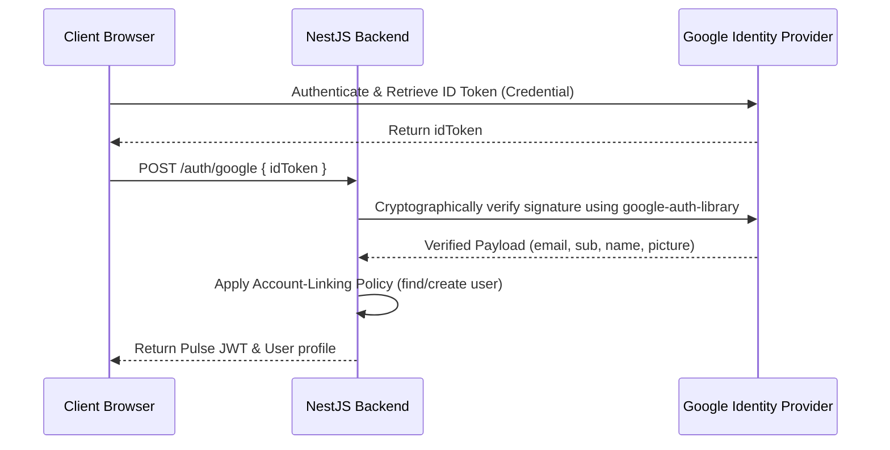

# Google OAuth Integration in Pulse

This document outlines the architecture, database schema, configuration, account-linking policy, and testing strategy for the Google OAuth 2.0 integration in Pulse.

---

## 1. Architecture Overview
Google Sign-In is integrated as an alternative authentication method that yields a standard Pulse JWT session.



---

## 2. Database Schema
The standard `User` model in `prisma/schema.prisma` was modified to support social logins without breaking existing credentials:

```prisma
model User {
  id            String            @id @default(uuid())
  email         String            @unique
  username      String            @unique
  displayName   String?           @map("display_name")
  bio           String?
  avatarUrl     String?           @map("avatar_url")
  password      String?           // Optional for Google-only users
  googleId      String?           @unique @map("google_id") // Stable Google account subject id
  ...
}
```

---

## 3. Environment Configuration
The backend and frontend use environment variables defined in `.env` (or config registries):

| Scope | Variable | Default / Mock Value | Description |
|---|---|---|---|
| Backend | `GOOGLE_CLIENT_ID` | `mock-client-id` | Registered Client ID in Google Developer Console |
| Backend | `GOOGLE_CLIENT_SECRET` | `mock-client-secret` | Google OAuth Client Secret credential |
| Frontend | `NEXT_PUBLIC_GOOGLE_CLIENT_ID` | `mock-client-id` | Client ID exposed to browser for rendering GSI button |

*Note: Environment validation falls back to mock strings during development to prevent initialization crashes.*

---

## 4. Backend Authentication & Account Linking
The backend uses `google-auth-library` via the `googleClient.verifyIdToken` API to verify the authenticity of the token.

### Account Linking Policy
When a verified ID token payload is received, the backend applies the following sequential lookup:
1. **Lookup by `googleId`**: If a user record is found matching the stable subject identifier (`googleId`), they are logged in directly.
2. **Lookup by `email`**: If no `googleId` matches, but a user record matches the verified `email`:
   - The user record is updated to link the `googleId`.
   - Missing profile info (such as `displayName` or `avatarUrl`) is updated from the Google payload.
   - The user's existing email/password password hash is kept intact.
3. **Registration**: If no account matches, a new user is created with a `null` password and a unique username generated from their email prefix.

### Security Safeguards
Standard password logins via `bcrypt.compare` are secured. If a Google-only user tries to log in via email/password, the API will fail with `UnauthorizedException` before comparing passwords, preventing crashes or authentication bypass.

---

## 5. Frontend GSI Integration
The frontend login ([page.tsx](file:///c:/Users/ADMIN/Desktop/pern/assesment/pulse/apps/web/src/app/login/page.tsx)) and registration ([page.tsx](file:///c:/Users/ADMIN/Desktop/pern/assesment/pulse/apps/web/src/app/register/page.tsx)) pages dynamically load Google's Identity Services script (`https://accounts.google.com/gsi/client`).

- **Native Button**: If `NEXT_PUBLIC_GOOGLE_CLIENT_ID` is set to a real client ID, the native Google Sign-In button is rendered inside `<div id="google-signin-btn" />`.
- **Demo / Mock Mode**: If `NEXT_PUBLIC_GOOGLE_CLIENT_ID` is unset or set to `'mock-client-id'`, the page renders a custom premium button ("Continue with Google (Demo)") that sends a predefined payload (`'valid-google-id-token'`) to bypass external API requirements during local development.

---

## 6. Integration Testing
Tests in `pulse-integration.spec.ts` mock `google-auth-library` to test flows without calling external Google endpoints:
- Google account registration.
- Login for existing Google users.
- Safe linking to email/password accounts.
- Rejection of invalid Google tokens.
- Secure email/password login behavior for Google-only users.
