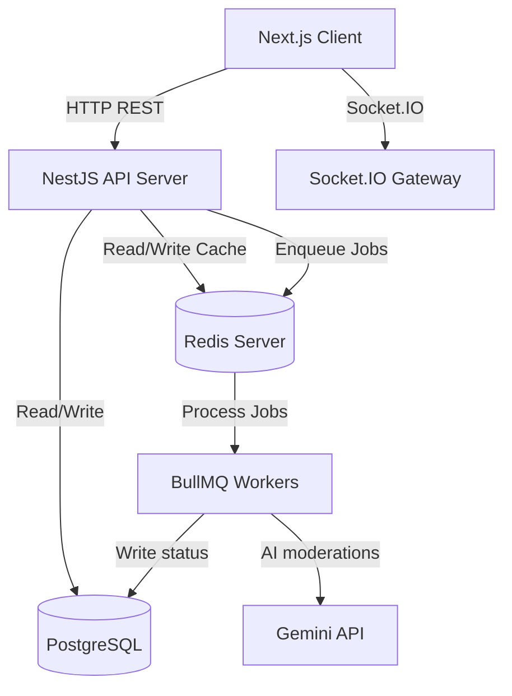
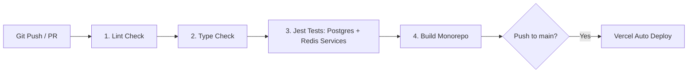

# Pulse — Developer Social Platform

Pulse is a high-performance, production-oriented developer social platform built to demonstrate advanced system architecture, real-time communications, scalable caching paradigms, and asynchronous background jobs.

---

## 1. Product Overview
Pulse is a professional networking and content sharing platform customized for developers. It supports rich user profiles, community forums, real-time messaging, content feed generation with cursor pagination, and asynchronous AI-assisted moderation.

## 2. Business Value
By decoupling rendering from business logic and adopting high-availability caching and background runners, Pulse reduces database read-write contentions, isolates resource-heavy AI checks from the request-response thread, and guarantees low latencies for scaling active users.

## 3. Feature List
- **Stateless Authentication**: Signup, password hashing via bcrypt, stateless JWT issuance.
- **Social Content Core**: Post/Comment creation, like/unlike, bookmarking, and reposting.
- **Dynamic Follows**: Follow/unfollow relations with self-following prevention.
- **Asynchronous Moderation**: Multi-tier safety gates using external AI and local rule fallback layers.
- **Hybrid Real-Time Chat**: REST-based messaging with WebSockets for dynamic typing indicators, live socket routing, and active connection tracking.
- **Admin Dashboard**: Real-time platform analytics tracking active users, APPROVED posts, comments, and messages count.

## 4. Screenshots
*Screenshots representing the Next.js desktop interface will be displayed here, showcasing the dark glassmorphic feed layout, the sidebar navigation, the real-time chat window, and the green active status badges on user avatars.*

## 5. Tech Stack
- **Frontend**: Next.js 16 (App Router), React 19, TypeScript, React Query (TanStack Query) for query caching and optimistic mutations, Socket.io Client for notification rooms, Vanilla CSS for glassmorphism layout.
- **Backend**: NestJS (TypeScript), Passport JWT, class-validator, Prisma ORM.
- **Cache & Telemetry**: Redis (ioredis) managing rate limits, presence trackers, and feed caches.
- **Queue**: BullMQ registered on Redis pools for transactional runners.
- **Primary Database**: PostgreSQL 16 database.

## 6. Architecture
Pulse divides responsibilities between two workspaces inside a monorepo setup:
- `apps/web`: Handles client rendering, client-side queries, and WebSocket handshake instances.
- `apps/api`: Handles API requests, JWT verification, database calls, caching logic, and worker queues.



## 7. Database Design
Pulse maps relationships using a PostgreSQL relational database structured via Prisma:
- **User**: Stores profiles, credential hash, active timestamps (`lastActiveAt`), and roles (`USER`, `ADMIN`, `MODERATOR`).
- **Post / Comment**: Stores textual content, images, author IDs, and safety status states (`PENDING`, `APPROVED`, `FLAGGED`, `REJECTED`), alongside `moderationReason` and `moderatedAt` fields.
- **Like / Bookmark / Repost / Follow**: Many-to-many relationship tables mapped with unique composite indexes (`userId_postId`, `followerId_followingId`) to prevent duplicate transactions.
- **Conversation**: Direct chat conversation rooms. Stores `directKey` unique index (deterministic format: `[userAId, userBId].sort().join(':')`) to prevent duplicate 1-to-1 conversation entries.

## 8. Authentication
Pulse uses stateless JWT (JSON Web Tokens) verification:
- On registration, passwords are encrypted via `bcrypt` and saved.
- On login, a stateless JWT is signed containing the user ID, email, and role.
- All requests to protected controllers are intercepted by a `JwtAuthGuard` mapping authorization bearer tokens. Tokens are stateless and not persisted in database or cache.

## 9. Feed Architecture
Pulse implements **Cursor-Based Pagination** sorting items by `createdAt: 'desc'` and fetching records using post IDs as cursors (skipping 1 post if cursor is present). 
To optimize feed load times, Pulse batches likes, bookmarks, and reposts states in single queries using database `findMany` sets to avoid N+1 query patterns. Results are cached in Redis (`feed:user_${userId}:*`) with a 120-second TTL. The cache is invalidated dynamically using Redis `scanStream` when a user creates a post or interacts with content.

## 10. Real-Time Notifications
When a user likes/comments/reposts content or follows another user:
1. The request hits the NestJS HTTP controller.
2. The notification record is persisted in the PostgreSQL database.
3. The server checks active connections in `NotificationsGateway` and emits a live event (`notification`) to the target user's room (`user_userId`).

## 11. Chat Architecture
Pulse implements a hybrid REST and WebSocket chat architecture:
1. **Message Submission**: Client sends messages using HTTP REST (`POST /api/v1/chat/conversations/:id/messages`).
2. **Access Control**: The controller verifies authorization and room membership before saving.
3. **Database Persistence**: The message is saved in the PostgreSQL database.
4. **WebSocket Delivery**: After DB persistence succeeds, the message is emitted via the `ChatGateway` room using Socket.IO (`to(conversationId).emit('message')`).
5. **Typing Indicators**: WebSockets are used to dispatch throttled client-to-client typing signals (`typing` $\to$ `user_typing`) dynamically.

## 12. Redis
Redis serves four active workloads:
1. **Feed Cache**: Caches feed responses under user-specific cursor keys with a 120s TTL.
2. **Rate Limiting**: Custom `RateLimiterGuard` tracks request frequencies atomically.
3. **Presence Tracker**: Tracks user sockets count in a Redis Set (`online:user:${userId}`). User is marked `online` if the cardinality is $>0$, and `offline` when it drops to `0`.
4. **BullMQ Storage**: Serves as the database storage backend for job queues.

## 13. BullMQ
Heavy out-of-band computations are enqueued to a Redis-backed BullMQ runner:
- **email-queue**: Dequeues registration tasks; logs welcome actions (mocked email delivery).
- **moderation-queue**: Dequeues safety content verification tasks to check created post/comment texts.

## 14. AI
Pulse links text composition and moderation checks to external Gemini API models:
- **AI Post Assistant**: Adjusts compositions through REST endpoints (`/ai/refine`) for different tones. If the API is missing or fails, it throws a `503 Service Unavailable` error instead of returning mocked text.
- **Timeout Protection**: All API calls are protected by a strict **5-second timeout** using `AbortController` to prevent server hang-ups.
- **Model Mapping**: Configured dynamically using the `GEMINI_MODEL` environment variable.

## 15. Moderation
Every post and comment is moderated asynchronously:
1. Content is enqueued to `moderation-queue` upon creation.
2. The worker calls `AiService.moderateContent` using the Gemini model.
3. If the external AI call fails, it falls back to a **Local Blacklist regex check** (`spam`, `malware`, `offensive`, `abuse`, `hack`).
4. The database is updated with the status (`APPROVED`, `FLAGGED`, `REJECTED`), a detailed `moderationReason`, and `moderatedAt` timestamp.
5. PENDING, FLAGGED, and REJECTED content is omitted from public feeds. Admins and authors can view pending items; only admins can view flagged/rejected entries.

## 16. Search & Trending
- **Search**: Executes case-insensitive `findMany` filters on posts, comments, or users.
- **Trending**: Candidate posts created within the last 7 days are loaded. The application scores each post using the formula:
  $$\text{Score} = (\text{likes} \times 2) + (\text{comments} \times 3) + (\text{reposts} \times 4) + \text{freshness component}$$
  Where the freshness component decays over time. Only approved content is allowed in trending.

## 17. Security
- **Helmet Headers**: Configures security-focused HTTP response headers.
- **Origin CORS Gates**: Strict CORS setup on HTTP and WebSockets allowing only configured origins (Vercel production URL and Localhost).
- **Rate Limiters**: Tracks request quotas dynamically on auth and AI compose controllers.

## 18. CI/CD
Pulse uses GitHub Actions for continuous integration.


## 19. Deployment
- **Frontend**: Automatically deployed to **Vercel** via GitHub Actions on pushes to the `main` branch.
  - **Frontend Deploy URL**: [https://pulse-web-dev.vercel.app/](https://pulse-web-dev.vercel.app/)
- **Backend**: Hosted on **Railway** as a persistent Node process.
- **Database / Cache**: Uses managed PostgreSQL and managed Redis services on Railway.
- **Database Migrations**: Applied during backend deployment using `npx prisma migrate deploy`.

### Default Demo Credentials
For testing local or production builds, use the following seeded accounts:
- **Administrator**:
  - **Email**: `admin@pulse.dev` (or Username: `admin`)
  - **Password**: `Password123!`
- **Developer (Standard User)**:
  - **Email**: `rauchg@pulse.dev` (or Username: `rauchg` / `yyx990803`)
  - **Password**: `Password123!`

## 20. Environment Variables

### Frontend (Next.js)
- `NEXT_PUBLIC_API_URL`: Production backend URL (e.g. `https://api.pulse.dev/api/v1`).
- `NEXT_PUBLIC_WS_URL`: Production Socket.io server endpoint (e.g. `https://api.pulse.dev`).

### Backend (NestJS)
- `PORT`: Backend port (default: `4000`).
- `DATABASE_URL`: PostgreSQL connection string.
- `REDIS_URL`: Redis connection URL.
- `JWT_SECRET`: Stateless JWT signature key.
- `FRONTEND_URL`: CORS allowed origin URL.
- `GEMINI_API_KEY`: API access key.
- `GEMINI_MODEL`: Model name (default: `gemini-1.5-flash`).

## 21. Local Development

### 1. Prerequisites
Install Node.js (v18+), PostgreSQL, and Redis.

### 2. Setup
```bash
# Install dependencies
npm install

# Run database migrations
npm run db:migrate

# Generate Prisma Client
npm run db:generate
```

### 3. Start Development
```bash
npm run dev
```
- Web: `http://localhost:3000`
- API: `http://localhost:4000`

## 22. Testing
Pulse maintains a dual-testing strategy:
1. **Unit & Module Mock Tests**: `npm run test` executes isolated service tests.
2. **E2E Integration Test Suite**: Runs tests against actual PostgreSQL and Redis services (using mocked queues to prevent Bull connection leakage).
```bash
# Run test suite
npm run test
```

## 23. Engineering Trade-offs
- **PostgreSQL Transactional Truth**: Choosing PostgreSQL guarantees strict data consistency for financial/social interactions (like follow relationships and database-unique constraints) at the expense of horizontally scaling database write throughput compared to NoSQL alternatives.
- **Redis for Transient Workloads**: Used for caching and rate limiting to offload database query volumes. However, it introduces cache invalidation complexities.
- **REST + WebSocket Hybrid Chat**: REST handles auth, access control, validation, and database persistence reliably. WebSocket handles real-time delivery and presence tracking. This reduces long-running WebSocket connections and limits connection overhead.
- **Bounded Trending Calculation**: Trending scores are calculated on-demand in application memory from recent posts, avoiding heavy background DB analytics pipelines. However, this is bounded to posts from the last 7 days to maintain $O(N)$ memory safety.
- **Stateless JWT**: Eliminates session lookups on database or caching layers, but tokens cannot be invalidated mid-lifespan without introducing blacklist stores.

## 24. Known Limitations
- **Local Fallback Accuracy**: The local rule-based safety fallback relies on simple RegEx matching. This lacks context safety awareness compared to semantic LLM moderations.
- **No Direct Binary Uploads**: The post composer supports only external image links, bypassing S3 binary storage streams.

## 25. Future Improvements
- **Media Upload Pipeline**: Introduce S3 storage buckets with asynchronous media compression jobs handled via BullMQ.
- **Refresh Token Rotation**: Implement cookie-based JWT token rotation to enhance credential lifetimes.